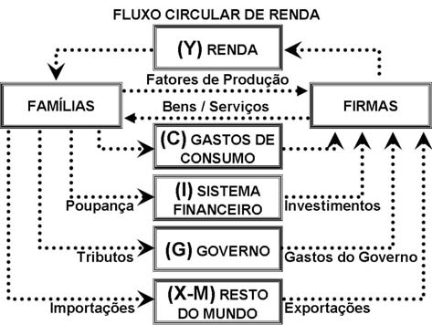

```{r setup, include = F}
library(knitr)

knitr::opts_chunk$set(echo = T, error = F, warning = F, message = F)
```

# As contas nacionais

1. Principal fonte de estatísticas macroeconômicas;<br>
2. Sistema de avaliação consistente, padronizado e contínuo da atividade econômica;<br>
3. Acompanha as transações econômicas que decorrem do processo de produção;<br>
4. Tem como referência o manual das nações unidas;<br>
5. Surge com a teoria de Keynes em 1937.

# O fluxo circular da renda

As famílias poupam dinheiro $\rightarrow$ as empresas financiam $\rightarrow$ e o dinheiro gira.

\begin{center}
\emph{Figura 1}
\end{center}

```{r, echo = F, error = F, warning = F, message = F, fig.align = "center", out.width="50%"}

```

# Identidades macroeconômicas básicas

**Produto Agregado = Despesa Agregada = Renda Agregada** $\rightarrow$ mesmo que as pessoas poupem, a identidade se manterá, uma vez que o mercado financeiro faz com que esse dinheiro tenha destinação.

1. **PIB**: é o valor de mercado *(i)* de todos os bens e serviços finais *(ii)* produzidos *(iii)* em determinado país *(iv)*, em determinado período de tempo *(v)*.
    + *(i)* **Valor de mercado**: para ser possível a comparação de produtos diferentes;
    + *(ii)* **Todos bens e serviços finais**: que sejam legais e computacionados, desconsiderando o produto intermediário;
    + *(iii)* **Produzidos**: quando foi produzido;
    + *(iv)* **Em determinado país**: dentro do território nacional, não importando a nacionalidade do produtor;
    + *(v)* **Determinado período de tempo**: não é um fluxo. É de período em período, base para comparações.

2. **Óticas de mensuração do PIB**
    + *(i)* **Ótica da produção**: soma dos produtos finais da indústria, do comércio, do setor de serviços e da atividade agropecuária (não sendo contabilizado o uso da matéria-prima). É feito dessa forma para evitar que alguns produtos sejam contabilizados mais de uma vez;
    + *(ii)* **Ótica da renda**: soma-se todas as remunerações com base nos salários, juros, aluguéis e lucros distribuídos;
    + *(iii)* **Ótica da despesa (dispêndio)**: soma dos gastos para a manutenção (**consumo**) e a expansão da economia (**investimento**).
    
3. **PIB per capita**: é a divisão do PIB do ano corrente pela pela **população residente** no mesmo período.

4. **Renda Nacional**: é o agregado que considera o **valor adicionado** gerado pelos fatores de produção de **propriedade de residentes**.

5. **Renda Nacional Bruta (RNB)**: é a Renda Nacional subtraída da **Renda Líquida Enviada ao Exterior (RLEE)**. Há também a contraparte, isto é, a **Renda Líquida Recebida do Exterior (RLRE)**.
    + *(i)* se a $RLEE < RLRE$, então $RNB > PIB$;
    + *(i)* se a $RLEE > RLRE$, então $RNB < PIB$.
    
$$RNB = PIB - RLEE$$

&emsp;&emsp; As diferenças entre PIB e RNB podem ser grandes quando: *(i)* um país tem muito endividamento externo, ou *(ii)* há muitas empresas multinacionais que remetem lucros e royalties.

6. **Renda Nacional Disponível Bruta (RDB)** e a **Renda Privada Disponível (RPD)**: a RDB difere-se da RNB por considerar as **Transferências correntes Unilaterais (TUR)**, que são as movimentações entre residentes e não-residentes **sem contrapartida** com o processo de produção.

\begin{center}
$RDB = RNB + TUR$, em que $RDB = C + S_d$
\end{center}


Onde: $C$ = Consumo e $S_d$ = Poupança Doméstica.

\begin{center}
$RNB = RDB - TUR \rightarrow PIB = RDB + RLEE - Saldo_{TUR}$
\end{center}

7. **Renda Líquida do Governo (RLG)**: receitas do governo (tributos, impostos diretos e indiretos, etc) subtraído de suas despesas (subsídios, transferências, etc).

$$RPD = RDB - RLG \rightarrow RLG = RDB - RPD$$

8. **Produto Interno Líquido (PIL)**: desconta a depreciação do capital utilizado no esforço produtivo.

\begin{center}
$PIL = PIB$ - Depreciação
\end{center}